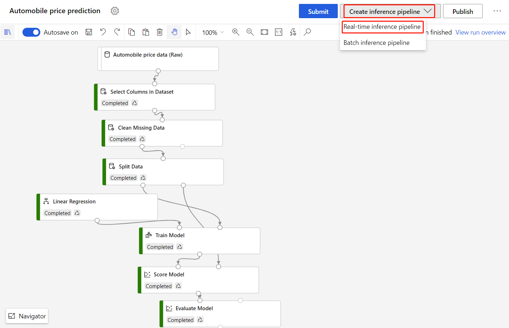
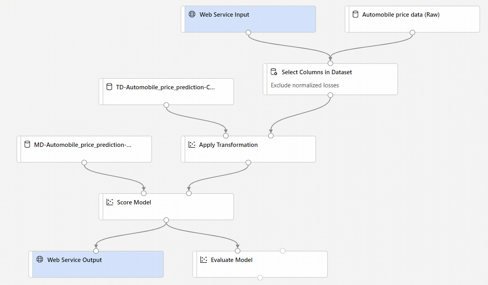

This workshop is based on the Microsoft tutorials for learning to deploy a model in Azure Machine Learning Studio.

This workshop contains three distinct tasks that will help you with understanding the moving parts when:
1) [Training a model](https://github.com/OrdinaRoelant/MLStudioWorkshop/blob/master/Training%20a%20model/workshop.md)
2) [**Deploying a model**](https://github.com/OrdinaRoelant/MLStudioWorkshop/blob/master/Deploying%20a%20model/workshop.md)
3) [Running automated machine learning experiments](https://github.com/OrdinaRoelant/MLStudioWorkshop/blob/master/Running%20auto%20ML%20experiments/workshop.md)

In this part we are going to deploy a model by:

✔ Create a real-time inference pipeline  
✔ Create an inferencing cluster  
✔ Deploy the real-time endpoint  
✔ Test the real-time endpoint  

## Training a model
In this part of the workshop we are going to deploy the model we trained in [part 1](https://github.com/OrdinaRoelant/MLStudioWorkshop/blob/master/Training%20a%20model/workshop.md). Be sure to finish that part first, before continuing with the deployment part.

## Create a real-time inference pipeline  
To deploy your pipeline, you must first convert the training pipeline into a real-time inference pipeline. This process removes training components and adds web service inputs and outputs to handle requests.

1) Above the pipeline canvas, select **Create inference pipeline** > **Real-time inference pipeline**  
**NOTE**: The screen takes a couple of seconds to load  
  
Your pipeline now looks like this  
  
When you select **Create inference pipeline**, several things happen:
- The trained model is stored as a **Dataset** component in the component palette. You can find it under **My Datasets**.
- Training components like **Train Model** and **Split Data** are removed.
- The saved trained model is added back into the pipeline.
- **Web Service Input** and **Web Service Output** components are added. These components show where user data enters the pipeline and where data is returned.
2) Select **Submit**, and use the same compute target and experiment that you used in part one

## Deploy the real-time endpoint  
1) Select **Deploy**
2) Enter a name for the endpoint respecting the naming convention: [prefix]-endpoint
3) Select the **Azure Container Instance** as the **Compute type**
4) Select **Deploy**  
**NOTE:** A success notification above the canvas appears after deployment finishes. It might take a few minutes.

## Test the real-time endpoint  
After deployment finishes, you can view your real-time endpoint by going to the Endpoints page.  

1) On the **Endpoints** page, select the endpoint you deployed. 
In the **Details** tab, you can see more information such as the REST URI, Swagger definition, status, and tags  
In the **Consume** tab, you can find sample consumption code, security keys, and set authentication methods  
In the **Deployment logs** tab, you can find the detailed deployment logs of your real-time endpoint  
2) To test your endpoint, go to the **Test** tab. From here, you can enter test data and select Test verify the output of your endpoint  

It is now time for part III: [Running automated machine learning experiments](https://github.com/OrdinaRoelant/MLStudioWorkshop/blob/master/Running%20auto%20ML%20experiments/workshop.md)