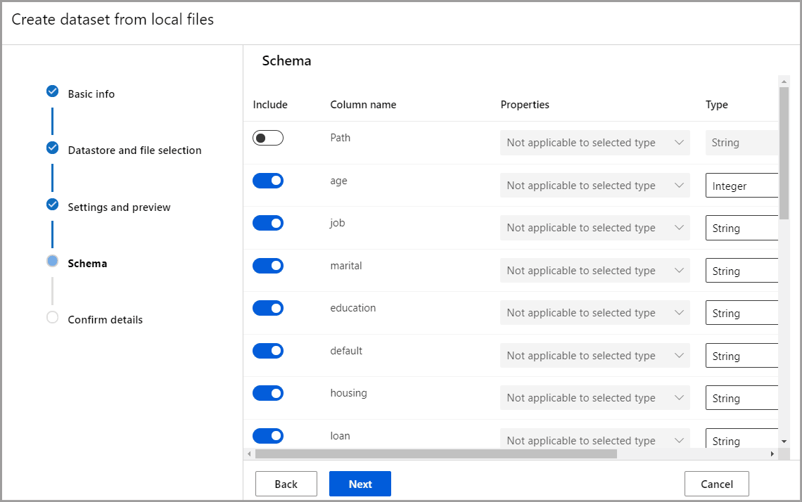
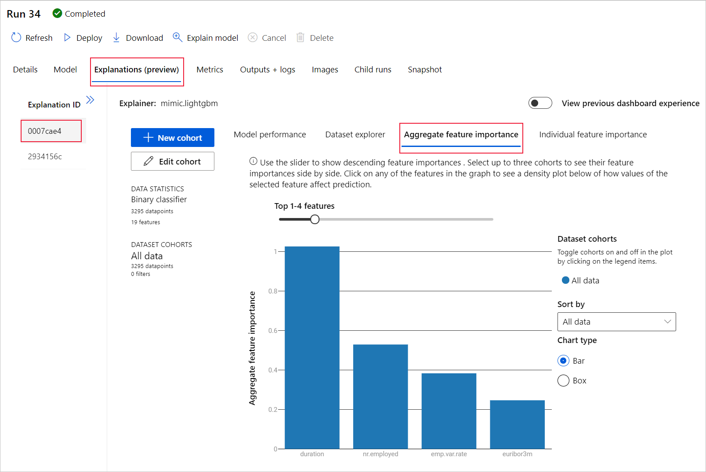

This workshop is based on the Microsoft tutorials for learning to train a model in Azure Machine Learning Studio.

This workshop contains four distinct tasks that will help you with understanding the moving parts when:
1) [Training a model](https://github.com/OrdinaRoelant/MLStudioWorkshop/blob/master/Training%20a%20model/workshop.md)
2) [Deploying a model](https://github.com/OrdinaRoelant/MLStudioWorkshop/blob/master/Deploying%20a%20model/workshop.md)
3) [**Running automated machine learning experiments**](https://github.com/OrdinaRoelant/MLStudioWorkshop/blob/master/Running%20auto%20ML%20experiments/workshop.md)

In this part we are going to run automated machine learning experiments by:

✔ Run an automated machine learning experiment  
✔ Explore model details  
✔ Deploy the recommended model  

In the previous two parts we made somewhat concious decisions around which algorithm to use in our machine learning experiment. Sometimes you will want to test out different algorithms and traing parameters to get the best fit for you dataset and usecase.

It is very time consuming to go through all these steps for each variation of training paramters. For this AutoML comes to the rescure.

## Run an automated machine learning experiment  

1) Select **Automated ML** in the main menu on the left under the **Author** section
2) Select **+New automated ML run**

### Create and load dataset
Before you configure your experiment, upload your data file to your workspace in the form of an Azure Machine Learning dataset. Doing so, allows you to ensure that your data is formatted appropriately for your experiment.  

1) Create a new dataset by selecting **From local files** from the **+Create dataset** drop-down  
2) On the **Basic info** form, give your dataset a name respecting naming convention and provide an optional description. The automated ML interface currently only supports TabularDatasets, so the dataset type should default to *Tabular*
3) Select **Next** on the bottom left
4) On the **Datastore and file selection** form, select the default datastore that was automatically set up during your workspace creation, **workspaceblobstore (Azure Blob Storage)**. This is where you'll upload your data file to make it available to your workspace
5) Select **Browse files** from the **Browse** drop-down
6) Choose the **bankmarketing_train.csv** file from this repository
7) Select **Next** on the bottom left, to upload it to the default container that was automatically set up during your workspace creation  
**NOTE:** When the upload is complete, the Settings and preview form is pre-populated based on the file type.
8) Verify that the Settings and preview form is populated as follows and select **Next**  

| Field | Desciption | Value |
| ----- | ----- | ----- |
| File format | Defines the layout and type of data stored in a file. | Delimited |
| Delimiter | One or more characters for specifying the boundary between  separate, independent regions in plain text or other data streams. | Comma |
| Encoding | Identifies what bit to character schema table to use to read your dataset. | UTF-8 |
| Column headers | Indicates how the headers of the dataset, if any, will be treated. | All files have same headers |
| Skip rows | Indicates how many, if any, rows are skipped in the dataset. | None 

9) The **Schema** form allows for further configuration of your data for this experiment. For this example, select the toggle switch for the **day_of_week**, so as to not include it. Select **Next**  
  
10) On the **Confirm details** form, verify the information matches what was previously populated on the **Basic info**, **Datastore and file selection** and **Settings and preview** forms.
11) Select **Create** to complete the creation of your dataset
12) Select your dataset once it appears in the list
13) Review the **Data preview** to ensure you didn't include **day_of_week** then, select **Close**
14) Select **Next**

### Configure run
After you load and configure your data, you can set up your experiment. This setup includes experiment design tasks such as, selecting the size of your compute environment and specifying what column you want to predict.  
1) Select the **Create new** radio button
2) Name the experiment following the naming convention
3) Select **y** as the target column, what you want to predict. This column indicates whether the client subscribed to a term deposit or not
4) Select **Compute instance** as your compute type
5) Select the running compute instance you created in part I
6) Select **Next**
7) Select **Classification** as the machine learning task type.
8) Select **View additional configuration settings** and populate the fields as follows. These settings are to better control the training job. Otherwise, defaults are applied based on experiment selection and data  

| Additional configurations | Desciption | Value |
| ----- | ----- | ----- |
| Primary metric | Evaluation metric that the machine learning algorithm will be measured by  | AUC_weighted |
| Explain best model | Automatically shows explainability on the best model created by automated ML | Enable |
| Blocked algorithms | Algorithms you want to exclude from the training job | None |
| Additional classification settings | These settings help improve the accuracy of your model | Positive class label: None |
| Exit criterion | If a criteria is met, the training job is stopped | Training job time (hours): 1 / Metric score threshold: None |
| Concurrency | The maximum number of parallel iterations executed per iteration | Max concurrent iterations: 5 |

9) Select **Save**
10) Select **Next**
11) On the **[Optional] Validate and test** form,
    - a) Select k-fold cross-validation as your **Validation type**
    - b) Select 2 as your **Number of cross validations**
12) Select **Finish** to run the experiment. The **Run Detail** screen opens with the **Run status** at the top as the experiment preparation begins. This status updates as the experiment progresses. Notifications also appear in the top right corner of the studio to inform you of the status of your experiment  

**NOTE:** Preparation takes 10-15 minutes to prepare the experiment run. Once running, it takes 2-3 minutes more for each iteration.

In production, you'd likely walk away for a bit. But for this tutorial, we suggest you start exploring the tested algorithms on the Models tab as they complete while the others are still running.

## Explore model details  
Navigate to the **Models** tab to see the algorithms (models) tested. By default, the models are ordered by metric score as they complete. For this tutorial, the model that scores the highest based on the chosen **AUC_weighted** metric is at the top of the list.

While you wait for all of the experiment models to finish, select the **Algorithm name** of a completed model to explore its performance details.

The following navigates through the **Details** and the **Metrics** tabs to view the selected model's properties, metrics, and performance charts.
  

### Model explanations
While you wait for the models to complete, you can also take a look at model explanations and see which data features (raw or engineered) influenced a particular model's predictions.  

These model explanations can be generated on demand, and are summarized in the model explanations dashboard that's part of the Explanations (preview) tab.  

To generate model explanations,
1) Select **Run 1** at the top to navigate back to the **Models** screen
2) Select the **Models** tab
3) For this tutorial, select the first **MaxAbsScaler**, **LightGBM** model
4) Select the **Explain model** button at the top. On the right, the **Explain model** pane appears
5) Select the **automl-compute** that you created previously. This compute cluster initiates a child run to generate the model explanations
6) Select **Create** at the bottom. A green success message appears towards the top of your screen
7) Select the **Explanations (preview)** button. This tab populates once the explainability run completes
8) On the left hand side, expand the pane and select the row that says **raw** under **Features**
9) Select the **Aggregate feature importance** tab on the right. This chart shows which data features influenced the predictions of the selected model.  
In this example, the duration appears to have the most influence on the predictions of this model.
 

## Deploy the recommended model 
The automated machine learning interface allows you to deploy the best model as a web service in a few steps. Deployment is the integration of the model so it can predict on new data and identify potential areas of opportunity.  

For this experiment, deployment to a web service means that the financial institution now has an iterative and scalable web solution for identifying potential fixed term deposit customers.  

Check to see if your experiment run is complete. To do so, navigate back to the parent run page by selecting Run 1 at the top of your screen. A **Completed** status is shown on the top left of the screen.  

Once the experiment run is complete, the **Details** page is populated with a **Best model summary** section. In this experiment context, **VotingEnsemble** is considered the best model, based on the **AUC_weighted** metric.  

**NOTE:** We deploy this model, but be advised, deployment takes about 20 minutes to complete. The deployment process entails several steps including registering the model, generating resources, and configuring them for the web service.  

1) Select **VotingEnsemble** to open the model-specific page  
2) Select the **Deploy** button in the top-left  
3) Populate the Deploy a model pane as follows:  

| Field | Value |
| ----- | ----- | 
| Deployment name| [prefix]-automl-deploy |
| Deployment description| My first automated machine learning experiment deployment |
| Compute type | Select Azure Compute Instance (ACI) |
| Enable authentication | Disable |
| Use custom deployments | Disable. Allows for the default driver file (scoring script) and environment file to be auto-generated. |

For this example, we use the defaults provided in the Advanced menu.

4) Select **Deploy** 
A green success message appears at the top of the **Run** screen, and in the **Model summary** pane, a status message appears under **Deploy status**. Select **Refresh** periodically to check the deployment status.  

Now you have an operational web service to generate predictions.