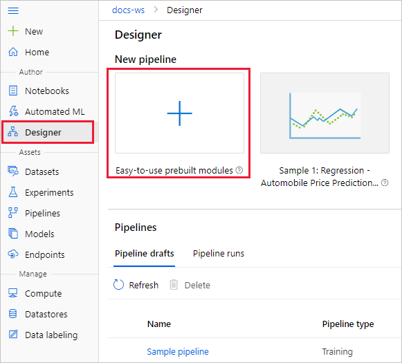
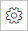

This workshop is based on the Microsoft tutorials for learning to train a model in Azure Machine Learning Studio.

This workshop contains three distinct tasks that will help you with understanding the moving parts when:
1) [**Training a model**](https://github.com/OrdinaRoelant/MLStudioWorkshop/blob/master/Training%20a%20model/workshop.md)
2) [Deploying a model](https://github.com/OrdinaRoelant/MLStudioWorkshop/blob/master/Deploying%20a%20model/workshop.md)
3) [Running automated machine learning experiments](https://github.com/OrdinaRoelant/MLStudioWorkshop/blob/master/Running%20auto%20ML%20experiments/workshop.md)

In this part we are going to train a model from scratch by:

✔ [Creating a pipeline](#create-a-new-pipeline)  
✔ [Importing your data](#importing-your-data)  
✔ [Prepare the data for training](#prepare-the-data-for-training)  
✔ [Training the actual model](#training-the-actual-model)  
✔ [Evaluating the model](#evaluating-the-model)  

## Naming convention
For this workshop we are going to share an Azure subscription and we will be using the same resource group. It is therefore highly recommended to prefix your resources names with you initials and age. In my case, for Roelant Dieben, 43 years old, I am going to prefix rd43-[resource name]

## Create a new pipeline
Azure Machine Learning pipelines organize multiple machine learning and data processing steps into a single resource. Pipelines let you organize, manage, and reuse complex machine learning workflows across projects and users.

To create an Azure Machine Learning pipeline, you need an Azure Machine Learning workspace. In this section, you learn how to create both these resources.

### Create a new workspace
You need an Azure Machine Learning workspace to use the designer. The workspace is the top-level resource for Azure Machine Learning, it provides a centralized place to work with all the artifacts you create in Azure Machine Learning. 

1) Sign in to the [Azure Portal](https://portal.azure.com) using the credentials provided to you
2) In the upper-left corner of Azure portal, select **+ Create a resource**
3) Use the search bar to find **Machine Learning**
4) Select **Machine Learning**
5) In the Machine Learning pane, select **Create** to begin
6) Provide the following information to configure your new workspace:

| Field | Description |
| ----------- | ----------- |
| Subscription | 6db2ddc7-e573-44a2-b036-6438722a11a2 |
| Resource group | rg-accelerator-days |
| Workspace name | Do not forget the naming convention! Suggestion: **[prefix]-workspace** |
| Region | West Europe |
| Storage account  | Leave default, creating new |
| Key Vault | Leave default, creating new |
| Application insights | Leave default, creating new |
| Container Registry | Leave none, we will create this later |

7) When you're finished configuring the workspace, select **Review + Create**.
8) Review the settings and make any other changes or corrections. When you're satisfied with the settings, select **Create**  
When the process is finished, and this can take several minutes, a deployment success message appears.
9) To view the new workspace, select **Go to resource**

### Create the pipeline
1) Click on the **Studio web URL** in the workspace overview. It should look like *ml.azure.com/?tlid=......*  
You will be taken to the Azure ML studio. Feel free to take the tour, or to do this at a later time.  
2) From the ML studio, select **Designer**  

3) Select **Easy-to-use prebuilt components**
4) At the top of the canvas, select the default pipeline name **Pipeline-Created-on**. Rename it to *Automobile price prediction*. The name doesn't need to be unique.

### Set the default compute target
A pipeline runs on a compute target, which is a compute resource that's attached to your workspace. After you create a compute target, you can reuse it for future runs.

1) Next to the pipeline name, select the Gear icon   at the top of the canvas to open the Settings pane
2) In the Settings pane to the right of the canvas, select **Create Azure ML compute instance**, or if you already have an available compute target, you can select it to run this pipeline
3) Enter a name for the compute resource using your prefix from the naming convention: [prefix]-compute
4) **Virtual machine type** should be CPU and pick **Standard_DS3_v2** as the virtual machine size
5) Select **Create**  
**NOTE**: It will take a couple of minutes for the compute resource to be created. You can continue the steps, but be mindful when you get to the training part. You will have to wait for the resource to be created and add it, or circle back and select it when you need it.

## Importing your data 

There are several sample datasets included in the designer for you to experiment with. For this workshop, use **Automobile price data (Raw)**.

1) To the left of the pipeline canvas is a palette of datasets and components. Select **Sample datasets** to view the available sample datasets
2) Select the dataset **Automobile price data (Raw)**, and drag it onto the canvas
  

### Visualize the data

1) Right-click the **Automobile price data (Raw)** and select **Preview Data**  
You can drag the DatasetOutput panel bigger, or click the expand icon   , to make viewing the data easier  
2) Select the different columns in the data window to view information about each one  
Each row represents an automobile, and the variables associated with each automobile appear as columns. There are 205 rows and 26 columns in this dataset.

## Prepare the data for training  

Datasets typically require some preprocessing before analysis. You might have noticed some missing values when you inspected the dataset. These missing values must be cleaned so that the model can analyze the data correctly.

### Remove a column

When you train a model, you have to do something about the data that's missing. In this dataset, the **normalized-losses** column is missing many values, so you will exclude that column from the model altogether.

1) Close the DatasetOutput panel and go the component palette to the left of the canvas (where you selected the dataset earlier), expand the **Data Transformation** section and find the **Select Columns in Dataset** component
2) Drag the **Select Columns in Dataset** component onto the canvas. Drop the component below the dataset component
3) Connect the **Automobile price data (Raw)** dataset to the **Select Columns in Dataset** component. Drag from the dataset's output port, which is the small circle at the bottom of the dataset on the canvas, to the input port of **Select Columns in Dataset**, which is the small circle at the top of the component  
  
4) Select the **Select Columns in Dataset** component
5) In the component details pane to the right of the canvas, select **Edit column**
6) Expand the **Column names** drop down next to Include, and select **All columns**
7) Select the + to add a new rule
8) From the drop-down menus, select **Exclude** and **Column names**
9) Enter *normalized-losses* in the text box
10) In the lower right, select **Save** to close the column selector
  
11) Select the **Select Columns in Dataset** component
12) In the component details pane to the right of the canvas, select the **Comment** text box and enter *Exclude normalized losses*  
Comments will appear on the graph to help you organize your pipeline. Notice the comment is now displayed in the component box on the canvas.  

### Clean missing data
Your dataset still has missing values after you remove the **normalized-losses** column. You can remove the remaining missing data by using the **Clean Missing Data** component.

1) In the component palette to the left of the canvas, expand the section **Data Transformation**, and find the **Clean Missing Data** component
2) Drag the **Clean Missing Data** component to the pipeline canvas. Connect it to the **Select Columns in Dataset** component
3) Select the **Clean Missing Data** component
4) In the component details pane to the right of the canvas, select **Edit Column**
5) In the **Columns to be cleaned** window that appears, expand the drop-down menu next to **Include**. Select, **All columns**
6) Select **Save**
7) In the **Clean Missing Data** properties, select **Remove entire row** under **Cleaning mode** (4th from the top)
8) In the component details pane to the right of the canvas, select the **Comment** box, and enter *Remove missing value rows*.

Your pipeline should now look something like this:  
  

## Training the actual model

Now that you have the components in place to process the data, you can set up the training components.

Because you want to predict price, which is a number, you can use a regression algorithm. For this example, you use a linear regression model.

### Split the data

Splitting data is a common task in machine learning. You will split your data into two separate datasets. One dataset will train the model and the other will test how well the model performed.

1) In the component palette, expand the section **Data Transformation** and find the **Split Data** component
2) Drag the **Split Data** component to the pipeline canvas
3) Connect the left port of the **Clean Missing Data** component to the **Split Data** component  
**IMPORTANT**: make sure it is the left port, since that one contains the cleaned data
4) Select the **Split Data** component
5) In the component details pane to the right of the canvas, set the **Fraction of rows in the first output dataset** to 0.7  
This option splits 70 percent of the data to train the model and 30 percent for testing it. The 70 percent dataset will be accessible through the left output port. The remaining data will be available through the right output port
6) In the component details pane to the right of the canvas, select the **Comment** box, and enter *Split the dataset into training set (70%) and test set (30%)*

### Adding the training component

Train the model by giving it a dataset that includes the price. The algorithm constructs a model that explains the relationship between the features and the price as presented by the training data.

1) In the component palette, expand **Machine Learning Algorithms**  
This option displays several categories of components that you can use to initialize learning algorithms.
2) Select **Regression** > **Linear Regression**, and drag it to the pipeline canvas
3) In the component palette, expand the section **Model training**, and drag the **Train Model** component to the canvas
4) Connect the output of the **Linear Regression** component to the left input of the **Train Model** component
5) Connect the training data output (left port) of the **Split Data** component to the right input of the **Train Model** component
  
6) Select the **Train Model** component
7) In the component details pane to the right of the canvas, select **Edit column** selector.
8) In the **Label column** dialog box, expand the drop-down menu and select **Column names**
9) In the text box, enter *price* to specify the value that your model is going to predict and select **Save**  
**IMPORTANT**: make sure to not capitalize *price*

### Adding the scoring component
After you train your model by using 70 percent of the data, you can use it to score the other 30 percent to see how well your model functions.  

1) Enter score model in the search box to find the **Score Model** component. Drag the component to the pipeline canvas
2) Connect the output of the **Train Model** component to the left input port of **Score Model**. Connect the test data output (right port) of the previously created **Split Data** component to the right input port of **Score Model**.

## Evaluating the model  

### Adding the evaluate component
Use the **Evaluate Model** component to evaluate how well your model scored the test dataset.  
1) Enter *evaluate* in the search box to find the **Evaluate Model** component. Drag the component to the pipeline canvas
2) Connect the output of the **Score Model** component to the left input of **Evaluate Model**  

The final pipeline should look something like this:
  

## Submit the pipeline
Now that your pipeline is all setup, you can submit a pipeline run to train your machine learning model. You can submit a valid pipeline run at any point, which can be used to review changes to your pipeline during development.  
1) At the top of the canvas, select **Submit**  
**NOTE:** If you created a new compute target earlier, you will get a message *Select compute target in settings panel*. We still need to select the compute target by circling back to [Set the default compute target](#set-the-default-compute-target)  
2) In the **Set up pipeline run** dialog box, select **Create new**  
**NOTE:** Experiments group similar pipeline runs together. If you run a pipeline multiple times, you can select the same experiment for successive runs  
     - For **New experiment Name**, enter **[prefix]-Tutorial-CarPrices**. Substituting the prefix for your personal prefix.
     - Select **Submit**  

You can view run status and details at the top right of the canvas.

If this is the first run, it may take a couple of minutes for your pipeline to finish running, but you can follow along in real-time. The default compute settings have a minimum node size of 0, which means that the designer must allocate resources after being idle. Repeated pipeline runs will take less time since the compute resources are already allocated. Additionally, the designer uses cached results for each component to further improve efficiency.

## View scored labels

After the run completes, you can view the results of the pipeline run. First, look at the predictions generated by the regression model.

1) Right-click the Score Model component, and select Preview data > Scored dataset to view its output.  
Here you can see the predicted prices and the actual prices from the testing data.

## Evaluate models
Use the **Evaluate Model** to see how well the trained model performed on the test dataset.

1) Right-click the **Evaluate Model** component and select **Preview data** > **Evaluation results** to view its output

The following statistics are shown for your model:
- **Mean Absolute Error (MAE)**: The average of absolute errors. An error is the difference between the predicted value and the actual value
- **Root Mean Squared Error (RMSE)**: The square root of the average of squared errors of predictions made on the test dataset.
- **Relative Absolute Error**: The average of absolute errors relative to the absolute difference between actual values and the average of all actual values.
- **Relative Squared Error**: The average of squared errors relative to the squared difference between the actual values and the average of all actual values.
- **Coefficient of Determination**: Also known as the R squared value, this statistical metric indicates how well a model fits the data.  

For each of the error statistics, smaller is better. A smaller value indicates that the predictions are closer to the actual values. For the coefficient of determination, the closer its value is to one (1.0), the better the predictions.

It is now time for part II: [Deploying our model](https://github.com/OrdinaRoelant/MLStudioWorkshop/blob/master/Deploying%20a%20model/workshop.md)